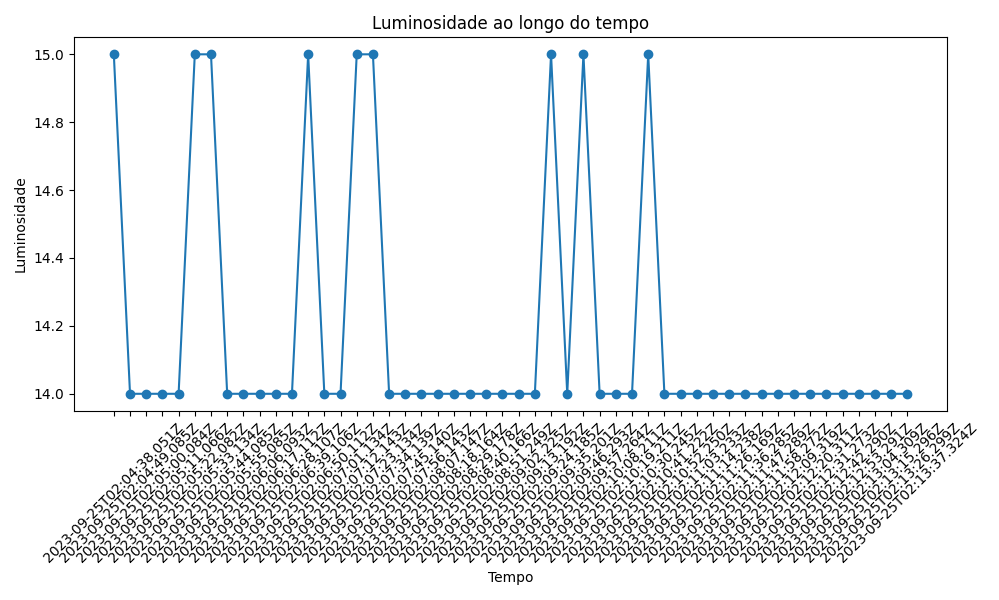
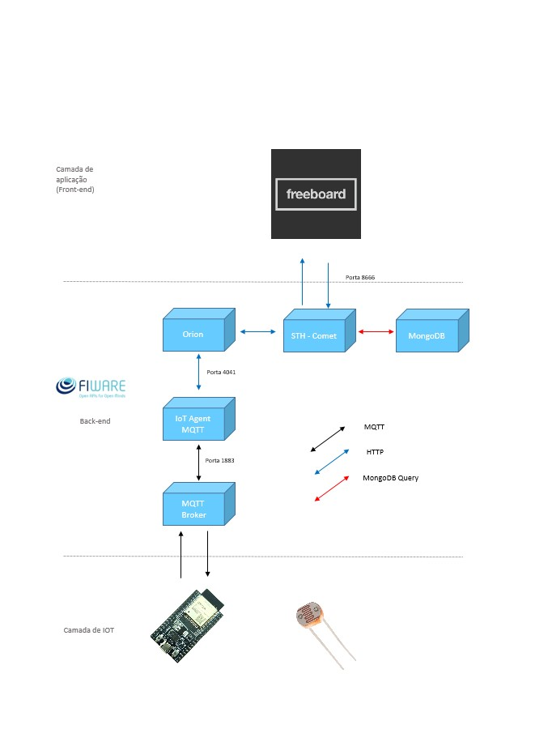
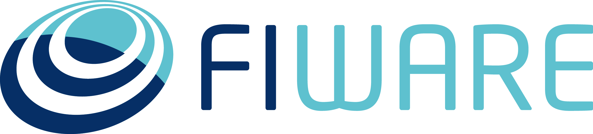
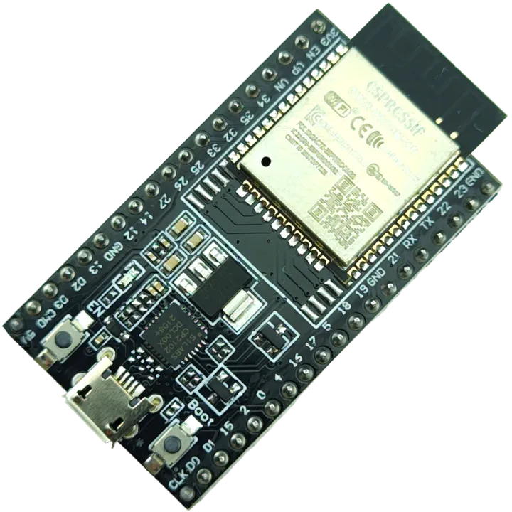
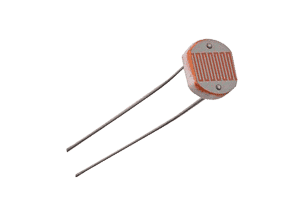

# 📈 Gráfico de leitura de luminosidade: 

  

## ✅ Arquitetura IoT: 

  

## 🔗 Camada de Aplicação(Front-End):

 

  

 

O projeto utilizará uma plataforma de dashboard chamada "Freeboard" como a base da camada de front-end. O Freeboard será responsável por exibir os dados coletados pelos sensores, como a luminosidade, por meio de widgets e gráficos. Isso garantirá que as informações sejam apresentadas de maneira fácil de entender e intuitiva para os usuários.

## 🔗 Camada de Back-End:

 

  

 

O projeto fará uso da plataforma Fiware como seu componente de back-end. O Fiware é uma plataforma de código aberto que oferece uma estrutura aberta e padronizada para o desenvolvimento de soluções inteligentes baseadas em IoT. Nesse contexto, o Fiware desempenhará um papel fundamental na coleta, transporte e processamento dos dados provenientes do sensor LDR.

Esses dados serão encaminhados para um painel de controle (a camada de front-end) onde serão analisados e monitorados. O objetivo principal é garantir a qualidade dos vinhos e manter as condições adequadas de armazenamento, possibilitando o controle eficiente dessas informações.

Essa plataforma Fiware proporciona a base tecnológica necessária para a construção de uma solução completa e integrada, permitindo a gestão inteligente dos dados coletados e fornecendo uma experiência aprimorada aos usuários finais.

---

A camada de back-end abriga componentes essenciais para a coleta, armazenamento e gerenciamento de dados de eficiência energética. Os principais componentes incluem:

**Orion Context Broker:**
- O Orion Context Broker gerencia as entidades e o contexto dos dispositivos IoT, garantindo coleta 	e atualização de dados em tempo real.

**STH-Comet:**
- O STH-Comet é responsável pelo armazenamento de dados históricos, incluindo informações de 	consumo de energia ao longo do tempo, permitindo análises retrospectivas e detecção de 	tendências. 

**IoT Agent MQTT:**
- Este agente IoT estabelece a comunicação eficaz entre os dispositivos IoT e a plataforma IoT, 	garantindo a transmissão confiável de dados.

**Banco de Dados NoSQL MongoDB:**
- O MongoDB armazena entidades, registros, subscrições e dados históricos, oferecendo 	escalabilidade e eficiência na gestão de dados.

**Eclipse-Mosquitto:**
- Um broker MQTT essencial para gerenciar a comunicação bidirecional entre os dispositivos de IoT e a aplicação.

A interação entre essas camadas é crucial para o funcionamento eficiente da aplicação IoT. Os dispositivos IoT coletam dados de consumo de energia e os enviam para a camada de back-end por meio dos protocolos MQTT ou HTTP/NGSIv2. Os dados são então processados pela camada de back-end, armazenados no MongoDB e disponibilizados para análise por meio da camada de aplicação.

## 🔗 Camada de IoT:

1. **ESP32:** O ESP32 é um microcontrolador de baixo consumo de energia amplamente usado em projetos de IoT. Ele atua como o cérebro do dispositivo IoT, executando programas que controlam a coleta de dados, a comunicação e outras tarefas. O ESP32 é responsável por conectar-se à rede (Wi-Fi, Bluetooth, ou outras tecnologias), coletar dados do sensor e enviar esses dados para a camada de back-end.

 

  

 

2. **Sensor LDR (Light Dependent Resistor):** O sensor LDR é um componente que detecta a intensidade da luz no ambiente. Ele é um dos dispositivos sensores comumente usados em projetos IoT para medir a luminosidade. 

 

  

